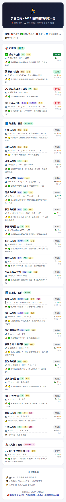

# 马拉松个人赛历和推荐

采集中国马拉松赛事日历，提供基于田协认证（A/B/C类）和世界田联标牌（白金标/金标/精英标/标牌）的赛事分级推荐。

> 本技能兼容 Codex、WorkBuddy 等主流 AI 工具，遵循标准 SKILL.md 格式，无绝对路径依赖。

## 用途与效果示例

AI 工具加载此技能后，能回答赛事推荐、查询认证级别、检查撞期和爬升数据，并输出手机端可直接分享的赛事报名一览表：



*430px 手机宽长截图，已报名→蹲省外→蹲省内→其他推荐 四大板块，每条赛事标注等级/爬升/状态/交通等完整信息。*

## 安装

```bash
# 将本仓库 clone 到 AI 工具的 skills 目录下
git clone https://github.com/njzyshare/marathon-calendar-skill.git
```

## 目录结构

```
marathon-calendar-skill/
├── SKILL.md                           # 技能定义（核心入口）
├── README.md                          # 本文件
├── marathon_calendar.py               # 闹跑+替补源采集脚本
├── references/
│   ├── report_style.md                # 报告书写风格规范
│   ├── geo_rules.md                   # 地区识别与交通规则
│   ├── ranking_rules.md               # 推荐分级策略
│   └── required_fields.md             # 每条赛事必采字段清单
├── scripts/
│   └── screenshot.js.md               # 截图生成方法
└── assets/
```
## 数据来源

| 优先级 | 来源 | 用途 |
|--------|------|------|
| 🥇 | 中国田协年度目录 | A/B/C类认证 |
| 🥇 | 世界田联官网/报道 | 白金/金/精英/标牌 |
| 🥇 | 最新新闻(搜狐/腾讯/抖音) | 精确比赛日期、报名/出签日期 |
| 🥉 | nowrun.cn 详情页 | 日期/起终点/爬升/报名 |
| 补充 | 搜索引擎 | 赛道特色/旅游信息 |

## 核心工作流

1. **先回答** — 文字结论包含：名称/级别/日期/报名/交通/难度
2. **问报告** — 是否生成？HTML 还是 PNG？
3. **补字段** — 模糊日期必须搜新闻确认，检查撞期
4. **标来源** — 报告底部逐项说明数据来源
5. **手机排版** — HTML 560px 卡片式，标签紧凑，状态居右

## 采集脚本用法

```bash
python marathon_calendar.py
```

从 nowrun.cn 获取全部 492 场赛事列表，自动抓取近期赛事详情（日期、起终点、爬升、报名费等），输出 JSON 和 HTML 赛历文件。

## 维护规范

- 所有路径引用使用相对路径
- 禁止包含绝对路径或用户个人信息
- 截图路径用 `${cwd}` 占位符，运行时推导
- 兼容跨 AI 工具加载

## 版本记录

| 版本 | 日期 | 内容 |
|------|------|------|
| **v1.7** | 2026-07-10 | **最终完美版** — 一次性生成HTML规范，板块4类分类，全马/半马标签和爬升列必填 |
| v1.6 | 2026-07-10 | 同步最新排版：右侧3行(st→c→d)，图标统一(✅⏳❌)，板块按A类+/非A有特色分类 |
| v1.5 | 2026-07-10 | 脱敏处理，移除硬编码地理信息，省份改为上下文变量 |
| v1.4 | 2026-06-23 | 跨工具兼容，手机排版，数据来源标准化，README |
| v1.3 | 2026-06-23 | 必采字段清单，精确日期+撞期检查 |
| v1.2 | 2026-06-23 | 目录重构，SKILL.md仅保留工作流 |
| v1.1 | 2026-06-23 | 报告风格、截图方法、赛道备注 |
| v1.0 | 2026-06-23 | 初始发布 |

## 许可

MIT
